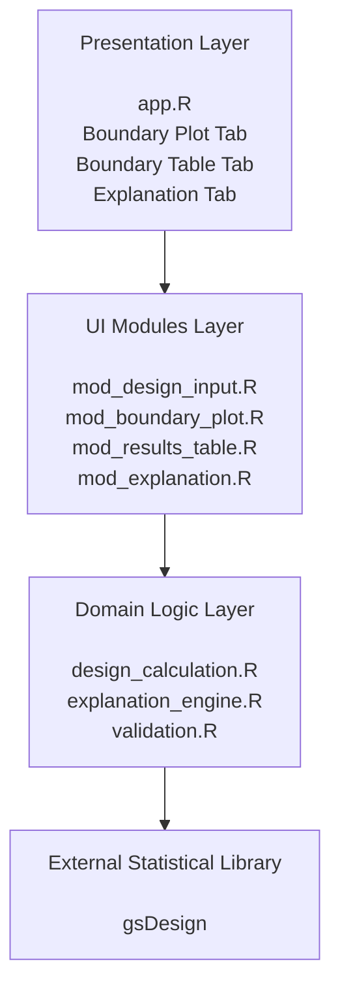
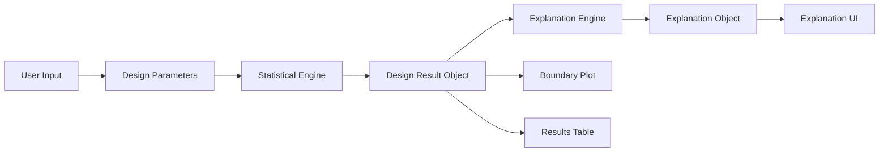

# Clinical Trial Design Explorer

An interactive R Shiny application for exploring group sequential clinical trial designs.

---

## Motivation

Clinical trial design is one of the fundamental disciplines of biostatistics. While established statistical software provides powerful tools for designing and analyzing clinical trials, these tools often focus on computation rather than understanding.

The goal of this project is not to replace professional software such as `gsDesign` or `rpact`. Instead, it aims to create an interactive environment in which users can explore statistical concepts, understand their underlying rationale, and develop intuition about the trade-offs involved in different trial designs.

This project focuses on making statistical methodology **visible**, **interactive**, and **explainable**.

---

# Philosophy

This application follows three guiding principles.

## 1. Scientific correctness

All statistical calculations are based on established methodology and implemented using validated statistical software whenever appropriate.

The project intentionally builds upon existing scientific work instead of reimplementing well-established numerical algorithms.

---

## 2. Interactive exploration

Rather than presenting static results, the application allows users to actively modify design parameters and immediately observe how these changes affect the statistical properties of a clinical trial.

The objective is to encourage exploration instead of passive observation.

---

## 3. Explainability

Most statistical software answers the question:

> **What is the result?**

This project additionally aims to answer:

> **Why does this result occur?**

Every visualization should eventually provide:

- an intuitive explanation
- the underlying statistical rationale
- the trade-offs implied by the selected design
- practical implications for clinical trials

---

# Project Goals

The application is designed around the following objectives.

- Interactive exploration of statistical methods
- Scientifically correct implementation
- Clean and modular software architecture
- Reusable visualization components
- Separation of statistical computation and presentation
- Educational value through contextual explanations

---

# Architecture

The application follows a layered architecture that separates presentation, application flow, domain logic, and external statistical dependencies.

Each layer has a distinct responsibility.

### Presentation Layer

`app.R` composes the application.

It defines the overall page layout, creates the navigation tabs, initializes the reactive data flow, and connects the individual modules.

It contains as little domain logic as possible.

### UI Modules Layer

The Shiny modules are responsible for individual parts of the user interface.

* `mod_design_input.R` collects the user-defined trial settings.
* `mod_boundary_plot.R` visualizes the calculated efficacy boundaries.
* `mod_results_table.R` presents the numerical results.
* `mod_explanation.R` renders the context-aware explanation.

The modules consume structured data objects instead of calling the statistical library directly.

### Domain Logic Layer

The domain layer contains the application-specific logic.

* `design_calculation.R` creates the group sequential design and transforms the package-specific result into a stable domain object.
* `explanation_engine.R` derives a structured explanation from the calculated design.
* `validation.R` validates domain-specific inputs and invariants.

This layer is independent of Shiny and can therefore be tested separately.

### External Statistical Library

The application currently uses `gsDesign` for the underlying group sequential design calculations.

The library is encapsulated behind the domain layer, which prevents package-specific result structures from leaking into the user interface.

---

## Data Flow

The central architectural idea is that the statistical computation produces a domain-specific result object.

This object serves as the stable interface for all downstream components:

* visualizations,
* tables,
* statistical summaries,
* and contextual explanations.

The explanation engine produces a second structured object that contains domain meaning without any Shiny elements or HTML tags.

This keeps application logic and presentation logic decoupled.

## Design Parameters

Responsible for collecting and validating all user-defined trial settings.

Examples include:

- significance level
- number of analyses
- information times
- stopping boundary
- one-sided or two-sided testing

---

## Statistical Engine

Transforms validated parameters into a statistical design using established statistical methodology.

Currently this layer wraps the `gsDesign` package while hiding implementation-specific details from the user interface.

---

## Result Object

The statistical engine produces a domain-specific result object.

This object represents the public interface between statistical computation and the visualization layer.

Because every visualization consumes the same result object, new UI components can be added without modifying the statistical backend.

---

## Visualization Modules

Visualization modules are intentionally independent from the statistical implementation.

Examples include:

- Boundary Plot
- Results Table
- Summary Cards
- Explanation Panels
- Future Interactive Visualizations

Each module only consumes the result object.

---

# Why a Result Object?

The statistical backend is intentionally encapsulated behind a domain-specific result object instead of exposing package-specific structures throughout the application.

This provides several advantages:

- separation of concerns
- easier testing
- interchangeable statistical backends
- reusable visualization components
- cleaner software architecture

As a result, the user interface does not depend directly on the implementation details of the underlying statistical library.

---

# Explainability

The central idea of this project is that statistical software should not only perform calculations but also support understanding.

For example, an efficacy boundary should not merely be displayed.

The application should additionally explain

- why the boundary has this shape,
- how the selected design allocates the overall Type I error,
- which trade-offs are introduced,
- and how these decisions affect the interpretation of a clinical trial.

Future versions therefore aim to provide dynamic explanations that adapt to the currently selected design.

---

# Current Features

- Group sequential designs
- O'Brien–Fleming boundaries
- Pocock boundaries
- One-sided and two-sided testing
- Adjustable number of analyses
- Adjustable information times
- Boundary visualization
- Summary tables
- Automated unit tests using `testthat`

---

# Planned Features

- Alpha spending visualization
- Dynamic explanation panel
- Sample size calculation
- Power analysis
- Kaplan–Meier simulation
- Survival endpoint support
- Adaptive designs
- Export of trial summaries
- Interactive educational examples

---

# Technologies

- R
- Shiny
- bslib
- gsDesign
- ggplot2
- testthat

---

# Vision

Clinical Trial Design Explorer is part of a broader collection of interactive applications whose purpose is to make mathematical and statistical models easier to explore, understand, and communicate.

Rather than serving as simple calculators, these applications are designed as **interactive exploration tools** that combine scientific correctness with intuitive visualization and contextual explanation.

The long-term goal is to help bridge the gap between statistical methodology and human understanding.